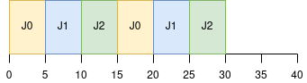
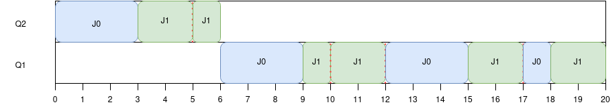
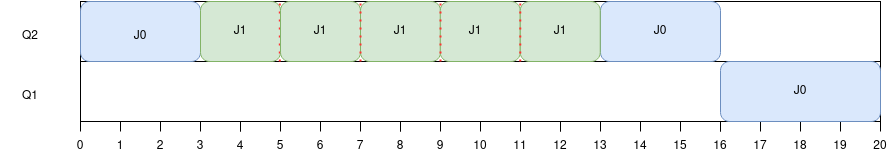

## Scheduling avanzado

Simulación de MLFQ
--------------
1. Se puede simular round-robin con el script de la siguiente manera:
* Utilizando una sola cola: --numQueues=1. Esto porque round-robin no utiliza colas de prioridad
* Definiendo un quantum de tiempo.  Por ejemplo, el mas sencillo: --quantum=1.

Con esto es suficiente para definir la política de planificación round-robin.
Se pueden agregar mas configuraciones, como tiempos de inicio distintos entre jobs, distinta duración de los jobs, cada cuanto tiempo tiene que realizar una operación de I/O.

Round robin mejora el response time (de hecho es la que mejor response time brinda), pero pagando el precio del turn-around time.
Con los siguientes parametros se va a poder ver un ejemplo de 3 tareas con 10 segundos de duración cada una y un quantum de 5 ut.

```bash
python2 ./mflq.py -c --numQueues=1 --quantum=5 --iotime=0 --numJobs=3 --jlist=0,10,0:0,10,0:0,10,0
```

```bash
Job List:
  Job  0: startTime   0 - runTime  10 - ioFreq   0
  Job  1: startTime   0 - runTime  10 - ioFreq   0
  Job  2: startTime   0 - runTime  10 - ioFreq   0

Execution Trace:

[ time 0 ] JOB BEGINS by JOB 0
[ time 0 ] JOB BEGINS by JOB 1
[ time 0 ] JOB BEGINS by JOB 2
[ time 0 ] Run JOB 0 at PRIORITY 0 [ TICKS 4 ALLOT 1 TIME 9 (of 10) ]
[ time 1 ] Run JOB 0 at PRIORITY 0 [ TICKS 3 ALLOT 1 TIME 8 (of 10) ]
[ time 2 ] Run JOB 0 at PRIORITY 0 [ TICKS 2 ALLOT 1 TIME 7 (of 10) ]
[ time 3 ] Run JOB 0 at PRIORITY 0 [ TICKS 1 ALLOT 1 TIME 6 (of 10) ]
[ time 4 ] Run JOB 0 at PRIORITY 0 [ TICKS 0 ALLOT 1 TIME 5 (of 10) ]
[ time 5 ] Run JOB 1 at PRIORITY 0 [ TICKS 4 ALLOT 1 TIME 9 (of 10) ]
[ time 6 ] Run JOB 1 at PRIORITY 0 [ TICKS 3 ALLOT 1 TIME 8 (of 10) ]
[ time 7 ] Run JOB 1 at PRIORITY 0 [ TICKS 2 ALLOT 1 TIME 7 (of 10) ]
[ time 8 ] Run JOB 1 at PRIORITY 0 [ TICKS 1 ALLOT 1 TIME 6 (of 10) ]
[ time 9 ] Run JOB 1 at PRIORITY 0 [ TICKS 0 ALLOT 1 TIME 5 (of 10) ]
[ time 10 ] Run JOB 2 at PRIORITY 0 [ TICKS 4 ALLOT 1 TIME 9 (of 10) ]
[ time 11 ] Run JOB 2 at PRIORITY 0 [ TICKS 3 ALLOT 1 TIME 8 (of 10) ]
[ time 12 ] Run JOB 2 at PRIORITY 0 [ TICKS 2 ALLOT 1 TIME 7 (of 10) ]
[ time 13 ] Run JOB 2 at PRIORITY 0 [ TICKS 1 ALLOT 1 TIME 6 (of 10) ]
[ time 14 ] Run JOB 2 at PRIORITY 0 [ TICKS 0 ALLOT 1 TIME 5 (of 10) ]
[ time 15 ] Run JOB 0 at PRIORITY 0 [ TICKS 4 ALLOT 1 TIME 4 (of 10) ]
[ time 16 ] Run JOB 0 at PRIORITY 0 [ TICKS 3 ALLOT 1 TIME 3 (of 10) ]
[ time 17 ] Run JOB 0 at PRIORITY 0 [ TICKS 2 ALLOT 1 TIME 2 (of 10) ]
[ time 18 ] Run JOB 0 at PRIORITY 0 [ TICKS 1 ALLOT 1 TIME 1 (of 10) ]
[ time 19 ] Run JOB 0 at PRIORITY 0 [ TICKS 0 ALLOT 1 TIME 0 (of 10) ]
[ time 20 ] FINISHED JOB 0
[ time 20 ] Run JOB 1 at PRIORITY 0 [ TICKS 4 ALLOT 1 TIME 4 (of 10) ]
[ time 21 ] Run JOB 1 at PRIORITY 0 [ TICKS 3 ALLOT 1 TIME 3 (of 10) ]
[ time 22 ] Run JOB 1 at PRIORITY 0 [ TICKS 2 ALLOT 1 TIME 2 (of 10) ]
[ time 23 ] Run JOB 1 at PRIORITY 0 [ TICKS 1 ALLOT 1 TIME 1 (of 10) ]
[ time 24 ] Run JOB 1 at PRIORITY 0 [ TICKS 0 ALLOT 1 TIME 0 (of 10) ]
[ time 25 ] FINISHED JOB 1
[ time 25 ] Run JOB 2 at PRIORITY 0 [ TICKS 4 ALLOT 1 TIME 4 (of 10) ]
[ time 26 ] Run JOB 2 at PRIORITY 0 [ TICKS 3 ALLOT 1 TIME 3 (of 10) ]
[ time 27 ] Run JOB 2 at PRIORITY 0 [ TICKS 2 ALLOT 1 TIME 2 (of 10) ]
[ time 28 ] Run JOB 2 at PRIORITY 0 [ TICKS 1 ALLOT 1 TIME 1 (of 10) ]
[ time 29 ] Run JOB 2 at PRIORITY 0 [ TICKS 0 ALLOT 1 TIME 0 (of 10) ]
[ time 30 ] FINISHED JOB 2

Final statistics:
  Job  0: startTime   0 - response   0 - turnaround  20
  Job  1: startTime   0 - response   5 - turnaround  25
  Job  2: startTime   0 - response  10 - turnaround  30

  Avg  2: startTime n/a - response 5.00 - turnaround 25.00
```


Podemos ver, como por ejemplo el job 0 va a tener un turn-around time mayor (el doble) respecto a una política de scheduling como FIFO o SJF.

2.
Se va a utilizar la siguiente configuración:
```-c --numQueues=3 --quantum=3  -a 1 -B 0 -i 0 --numJobs=2 --jlist=0,10,0:0,10,2```

Ver que cumple lo siguiente:
* MLFQ de 3 niveles: --numQueues=3.
* Allotment para que al terminar el quantum baje de prioridad en todas las colas: -a 1
* Mismo time slice: --quantum=3
* No hay boosting: -B 0
* 2 tareas: --numJobs=2
* Una sin I/O y otra con I/O: -jlist=0,10,0:0,10,2

También se modifica que el I/O sea instantaneo con el flag -i 0 para hacer más evidente el gaming.

Sin el flag -S. Sucede que al volver del I/O, sigue contando los ticks que tenía antes de la interrupcion.
```
Here is the list of inputs:
OPTIONS jobs 2
OPTIONS queues 3
OPTIONS allotments for queue  2 is   1
OPTIONS quantum length for queue  2 is   3
OPTIONS allotments for queue  1 is   1
OPTIONS quantum length for queue  1 is   3
OPTIONS allotments for queue  0 is   1
OPTIONS quantum length for queue  0 is   3
OPTIONS boost 0
OPTIONS ioTime 0
OPTIONS stayAfterIO False
OPTIONS iobump False


For each job, three defining characteristics are given:
  startTime : at what time does the job enter the system
  runTime   : the total CPU time needed by the job to finish
  ioFreq    : every ioFreq time units, the job issues an I/O
              (the I/O takes ioTime units to complete)

Job List:
  Job  0: startTime   0 - runTime  10 - ioFreq   0
  Job  1: startTime   0 - runTime  10 - ioFreq   2


Execution Trace:

[ time 0 ] JOB BEGINS by JOB 0
[ time 0 ] JOB BEGINS by JOB 1
[ time 0 ] Run JOB 0 at PRIORITY 2 [ TICKS 2 ALLOT 1 TIME 9 (of 10) ]
[ time 1 ] Run JOB 0 at PRIORITY 2 [ TICKS 1 ALLOT 1 TIME 8 (of 10) ]
[ time 2 ] Run JOB 0 at PRIORITY 2 [ TICKS 0 ALLOT 1 TIME 7 (of 10) ]
[ time 3 ] Run JOB 1 at PRIORITY 2 [ TICKS 2 ALLOT 1 TIME 9 (of 10) ]
[ time 4 ] Run JOB 1 at PRIORITY 2 [ TICKS 1 ALLOT 1 TIME 8 (of 10) ]
[ time 5 ] IO_START by JOB 1
IO DONE
[ time 5 ] IO_DONE by JOB 1
[ time 5 ] Run JOB 1 at PRIORITY 2 [ TICKS 0 ALLOT 1 TIME 7 (of 10) ]
[ time 6 ] Run JOB 0 at PRIORITY 1 [ TICKS 2 ALLOT 1 TIME 6 (of 10) ]
[ time 7 ] Run JOB 0 at PRIORITY 1 [ TICKS 1 ALLOT 1 TIME 5 (of 10) ]
[ time 8 ] Run JOB 0 at PRIORITY 1 [ TICKS 0 ALLOT 1 TIME 4 (of 10) ]
[ time 9 ] Run JOB 1 at PRIORITY 1 [ TICKS 2 ALLOT 1 TIME 6 (of 10) ]
[ time 10 ] IO_START by JOB 1
IO DONE
[ time 10 ] IO_DONE by JOB 1
[ time 10 ] Run JOB 1 at PRIORITY 1 [ TICKS 1 ALLOT 1 TIME 5 (of 10) ]
[ time 11 ] Run JOB 1 at PRIORITY 1 [ TICKS 0 ALLOT 1 TIME 4 (of 10) ]
[ time 12 ] IO_START by JOB 1
IO DONE
[ time 12 ] IO_DONE by JOB 1
[ time 12 ] Run JOB 0 at PRIORITY 0 [ TICKS 2 ALLOT 1 TIME 3 (of 10) ]
[ time 13 ] Run JOB 0 at PRIORITY 0 [ TICKS 1 ALLOT 1 TIME 2 (of 10) ]
[ time 14 ] Run JOB 0 at PRIORITY 0 [ TICKS 0 ALLOT 1 TIME 1 (of 10) ]
[ time 15 ] Run JOB 1 at PRIORITY 0 [ TICKS 2 ALLOT 1 TIME 3 (of 10) ]
[ time 16 ] Run JOB 1 at PRIORITY 0 [ TICKS 1 ALLOT 1 TIME 2 (of 10) ]
[ time 17 ] IO_START by JOB 1
IO DONE
[ time 17 ] IO_DONE by JOB 1
[ time 17 ] Run JOB 0 at PRIORITY 0 [ TICKS 2 ALLOT 1 TIME 0 (of 10) ]
[ time 18 ] FINISHED JOB 0
[ time 18 ] Run JOB 1 at PRIORITY 0 [ TICKS 0 ALLOT 1 TIME 1 (of 10) ]
[ time 19 ] Run JOB 1 at PRIORITY 0 [ TICKS 2 ALLOT 1 TIME 0 (of 10) ]
[ time 20 ] FINISHED JOB 1

Final statistics:
  Job  0: startTime   0 - response   0 - turnaround  18
  Job  1: startTime   0 - response   3 - turnaround  20

  Avg  1: startTime n/a - response 1.50 - turnaround 19.00
```




Con el flag -S. Sucede que al volver del I/O se reinicia los ticks
```
Here is the list of inputs:
OPTIONS jobs 2
OPTIONS queues 3
OPTIONS allotments for queue  2 is   1
OPTIONS quantum length for queue  2 is   3
OPTIONS allotments for queue  1 is   1
OPTIONS quantum length for queue  1 is   3
OPTIONS allotments for queue  0 is   1
OPTIONS quantum length for queue  0 is   3
OPTIONS boost 0
OPTIONS ioTime 0
OPTIONS stayAfterIO True
OPTIONS iobump False


For each job, three defining characteristics are given:
  startTime : at what time does the job enter the system
  runTime   : the total CPU time needed by the job to finish
  ioFreq    : every ioFreq time units, the job issues an I/O
              (the I/O takes ioTime units to complete)

Job List:
  Job  0: startTime   0 - runTime  10 - ioFreq   0
  Job  1: startTime   0 - runTime  10 - ioFreq   2


Execution Trace:

[ time 0 ] JOB BEGINS by JOB 0
[ time 0 ] JOB BEGINS by JOB 1
[ time 0 ] Run JOB 0 at PRIORITY 2 [ TICKS 2 ALLOT 1 TIME 9 (of 10) ]
[ time 1 ] Run JOB 0 at PRIORITY 2 [ TICKS 1 ALLOT 1 TIME 8 (of 10) ]
[ time 2 ] Run JOB 0 at PRIORITY 2 [ TICKS 0 ALLOT 1 TIME 7 (of 10) ]
[ time 3 ] Run JOB 1 at PRIORITY 2 [ TICKS 2 ALLOT 1 TIME 9 (of 10) ]
[ time 4 ] Run JOB 1 at PRIORITY 2 [ TICKS 1 ALLOT 1 TIME 8 (of 10) ]
[ time 5 ] IO_START by JOB 1
IO DONE
[ time 5 ] IO_DONE by JOB 1
[ time 5 ] Run JOB 1 at PRIORITY 2 [ TICKS 2 ALLOT 1 TIME 7 (of 10) ]
[ time 6 ] Run JOB 1 at PRIORITY 2 [ TICKS 1 ALLOT 1 TIME 6 (of 10) ]
[ time 7 ] IO_START by JOB 1
IO DONE
[ time 7 ] IO_DONE by JOB 1
[ time 7 ] Run JOB 1 at PRIORITY 2 [ TICKS 2 ALLOT 1 TIME 5 (of 10) ]
[ time 8 ] Run JOB 1 at PRIORITY 2 [ TICKS 1 ALLOT 1 TIME 4 (of 10) ]
[ time 9 ] IO_START by JOB 1
IO DONE
[ time 9 ] IO_DONE by JOB 1
[ time 9 ] Run JOB 1 at PRIORITY 2 [ TICKS 2 ALLOT 1 TIME 3 (of 10) ]
[ time 10 ] Run JOB 1 at PRIORITY 2 [ TICKS 1 ALLOT 1 TIME 2 (of 10) ]
[ time 11 ] IO_START by JOB 1
IO DONE
[ time 11 ] IO_DONE by JOB 1
[ time 11 ] Run JOB 1 at PRIORITY 2 [ TICKS 2 ALLOT 1 TIME 1 (of 10) ]
[ time 12 ] Run JOB 1 at PRIORITY 2 [ TICKS 1 ALLOT 1 TIME 0 (of 10) ]
[ time 13 ] FINISHED JOB 1
[ time 13 ] Run JOB 0 at PRIORITY 1 [ TICKS 2 ALLOT 1 TIME 6 (of 10) ]
[ time 14 ] Run JOB 0 at PRIORITY 1 [ TICKS 1 ALLOT 1 TIME 5 (of 10) ]
[ time 15 ] Run JOB 0 at PRIORITY 1 [ TICKS 0 ALLOT 1 TIME 4 (of 10) ]
[ time 16 ] Run JOB 0 at PRIORITY 0 [ TICKS 2 ALLOT 1 TIME 3 (of 10) ]
[ time 17 ] Run JOB 0 at PRIORITY 0 [ TICKS 1 ALLOT 1 TIME 2 (of 10) ]
[ time 18 ] Run JOB 0 at PRIORITY 0 [ TICKS 0 ALLOT 1 TIME 1 (of 10) ]
[ time 19 ] Run JOB 0 at PRIORITY 0 [ TICKS 2 ALLOT 1 TIME 0 (of 10) ]
[ time 20 ] FINISHED JOB 0

Final statistics:
  Job  0: startTime   0 - response   0 - turnaround  20
  Job  1: startTime   0 - response   3 - turnaround  13

  Avg  1: startTime n/a - response 1.50 - turnaround 16.50
```


Análisis:
En la primera versión (sin forzar el restart del contador), ocurre que cada 3 unidades de tiempo se van alternando el turno.
Como el allotment está en 1, bajan cuando termina el time slice. Así hasta el final de los jobs.
Con este método el job 0 termina en la ut 18 y el job 1 en la ut 20.

En la segunda versión, inicia de la misma manera el job 0, pero cuando termina su turno el job 1 toma y no suelta el CPU hasta terminar.
Como se seteo el I/O en cero (nada realista), se puede ver como de manera continua se ejecuta el job 1 desde el 3 hasta el 13 cuando finaliza.
En este caso el job 0 finaliza en la ut 20. Claramente, se pudo engañar al scheduler.

Mejorar scheduling de JOS
--------------
Para mejorar el scheduling, podemos asignar prioridades a los procesos.

Para ello asignamos un valor "nice" el cual tiene niveles desde -20 hasta el 19 (ambos inclusive). Aquellos procesos que tengan un valor inferior serán los que mejor prioridad tengan y viceversa.

También para brindar un manejo de prioridades vamos a tener una syscall que pueda modificar el valor de nice. Esto es así, para que el usuario no pueda modificar de manera explicita este valor y sacarle prioridad a otros procesos. De esta manera el kernel puede permitir que el proceso solo modifique SU prioridad o las de sus procesos hijos. Podemos usar envid2env para verificar justamente esto.

En sched_yield se utilizaba round-robin a secas, es decir, buscar el próximo proceso disponible a correr y ponerlo en marcha.
En este caso, el algoritmo es el siguiente:
* Se recorre todo el arreglo envs, guardando el indice en el que el env de mejor prioridad (o menor nice) está listo para correr.
* Si se encontró un env listo para correr, se inicia ese env
* Si el env que llamo a ```sched_yield``` puede seguir corriendo, también se lo tiene en cuenta para la prioridad. \*

\* Nota: Si no se tuviera en cuenta el proceso que llama a ```sched_yield``` (y que puede seguir corriendo), entonces las pruebas que implementamos no pasarían ya que dependen de que siempre se elija al de mejor prioridad, sin importar que haya hecho context-switch.
Sin embargo, esto hace que las pruebas ```spin0``` y ```spin``` no pasen ya que dependen de que el proceso que llame a sched_yield no vuelva a correr de manera inmediata.

Para probar el funcionamiento de esto, se creo 2 programas de usuario: ```envpriority``` y ```badenvpriority```.

1. envpriority

Inicialmente se setea el nice del proceso con -20. Luego se hace un fork y por defecto este tiene nice 10.
Luego de 3 iteraciones, se intercambian los roles. Se puede ver como el proceso padre no vuelve a ejecutarse 
hasta que termina su hijo.
```
...
[00000000] new env 00001000
Hello, I am environment 00001000, cpu 0, nice -20
[00001000] new env 00001001
Back in environment 00001000, iteration 0, cpu 0, nice -20
Back in environment 00001000, iteration 1, cpu 0, nice -20
Back in environment 00001000, iteration 2, cpu 0, nice -20
Se intercambian los roles de prioridad
Back in environment 00001001, iteration 0, cpu 0, nice -20
Back in environment 00001001, iteration 1, cpu 0, nice -20
Back in environment 00001001, iteration 2, cpu 0, nice -20
Back in environment 00001001, iteration 3, cpu 0, nice -20
Back in environment 00001001, iteration 4, cpu 0, nice -20
[00001001] exiting gracefully
[00001001] free env 00001001
Back in environment 00001000, iteration 3, cpu 0, nice 10
Back in environment 00001000, iteration 4, cpu 0, nice 10
[00001000] exiting gracefully
[00001000] free env 00001000
```
2. badenvpriority

En este programa simplemente se verifica que no se asignen prioridades que no están en el rango, y tampoco que pueda asignar prioridades a procesos que no son su hijo o si mismo. Por ejemplo los del rango 1000 a NENV. Si todo está bien, muestra el mensaje "All test passed".

3. manyenvpriority

Por ultimo para mostrar que siempre se respeta la prioridad, se crean procesos con todos los nice posibles (de -20 a 19). Se puede comprobar que elijen los procesos según el valor de nice.

```
[00000000] new env 00001000
Hello, I am environment 00001000, cpu 0, nice -20
[00001000] new env 00001001
[00001000] new env 00001002
...
[00001000] exiting gracefully
[00001000] free env 00001000
Back in environment 00001001, cpu 0, nice -19
[00001001] exiting gracefully
[00001001] free env 00001001
Back in environment 00001002, cpu 0, nice -18
[00001002] exiting gracefully
[00001002] free env 00001002
Back in environment 00001003, cpu 0, nice -17
[00001003] exiting gracefully
[00001003] free env 00001003
Back in environment 00001004, cpu 0, nice -16
[00001004] exiting gracefully
[00001004] free env 00001004
Back in environment 00001005, cpu 0, nice -15
[00001005] exiting gracefully
[00001005] free env 00001005
Back in environment 00001006, cpu 0, nice -14
[00001006] exiting gracefully
[00001006] free env 00001006
Back in environment 00001007, cpu 0, nice -13
[00001007] exiting gracefully
[00001007] free env 00001007
Back in environment 00001008, cpu 0, nice -12
[00001008] exiting gracefully
[00001008] free env 00001008
Back in environment 00001009, cpu 0, nice -11
[00001009] exiting gracefully
[00001009] free env 00001009
Back in environment 0000100a, cpu 0, nice -10
[0000100a] exiting gracefully
[0000100a] free env 0000100a
Back in environment 0000100b, cpu 0, nice -9
[0000100b] exiting gracefully
[0000100b] free env 0000100b
Back in environment 0000100c, cpu 0, nice -8
[0000100c] exiting gracefully
[0000100c] free env 0000100c
Back in environment 0000100d, cpu 0, nice -7
[0000100d] exiting gracefully
[0000100d] free env 0000100d
Back in environment 0000100e, cpu 0, nice -6
[0000100e] exiting gracefully
[0000100e] free env 0000100e
Back in environment 0000100f, cpu 0, nice -5
[0000100f] exiting gracefully
[0000100f] free env 0000100f
Back in environment 00001010, cpu 0, nice -4
[00001010] exiting gracefully
[00001010] free env 00001010
Back in environment 00001011, cpu 0, nice -3
[00001011] exiting gracefully
[00001011] free env 00001011
Back in environment 00001012, cpu 0, nice -2
[00001012] exiting gracefully
[00001012] free env 00001012
Back in environment 00001013, cpu 0, nice -1
[00001013] exiting gracefully
[00001013] free env 00001013
Back in environment 00001014, cpu 0, nice 0
[00001014] exiting gracefully
[00001014] free env 00001014
Back in environment 00001015, cpu 0, nice 1
[00001015] exiting gracefully
[00001015] free env 00001015
Back in environment 00001016, cpu 0, nice 2
[00001016] exiting gracefully
[00001016] free env 00001016
Back in environment 00001017, cpu 0, nice 3
[00001017] exiting gracefully
[00001017] free env 00001017
Back in environment 00001018, cpu 0, nice 4
[00001018] exiting gracefully
[00001018] free env 00001018
Back in environment 00001019, cpu 0, nice 5
[00001019] exiting gracefully
[00001019] free env 00001019
Back in environment 0000101a, cpu 0, nice 6
[0000101a] exiting gracefully
[0000101a] free env 0000101a
Back in environment 0000101b, cpu 0, nice 7
[0000101b] exiting gracefully
[0000101b] free env 0000101b
Back in environment 0000101c, cpu 0, nice 8
[0000101c] exiting gracefully
[0000101c] free env 0000101c
Back in environment 0000101d, cpu 0, nice 9
[0000101d] exiting gracefully
[0000101d] free env 0000101d
Back in environment 0000101e, cpu 0, nice 10
[0000101e] exiting gracefully
[0000101e] free env 0000101e
Back in environment 0000101f, cpu 0, nice 11
[0000101f] exiting gracefully
[0000101f] free env 0000101f
Back in environment 00001020, cpu 0, nice 12
[00001020] exiting gracefully
[00001020] free env 00001020
Back in environment 00001021, cpu 0, nice 13
[00001021] exiting gracefully
[00001021] free env 00001021
Back in environment 00001022, cpu 0, nice 14
[00001022] exiting gracefully
[00001022] free env 00001022
Back in environment 00001023, cpu 0, nice 15
[00001023] exiting gracefully
[00001023] free env 00001023
Back in environment 00001024, cpu 0, nice 16
[00001024] exiting gracefully
[00001024] free env 00001024
Back in environment 00001025, cpu 0, nice 17
[00001025] exiting gracefully
[00001025] free env 00001025
Back in environment 00001026, cpu 0, nice 18
[00001026] exiting gracefully
[00001026] free env 00001026
Back in environment 00001027, cpu 0, nice 19
[00001027] exiting gracefully
[00001027] free env 00001027
No runnable environments in the system!
```
